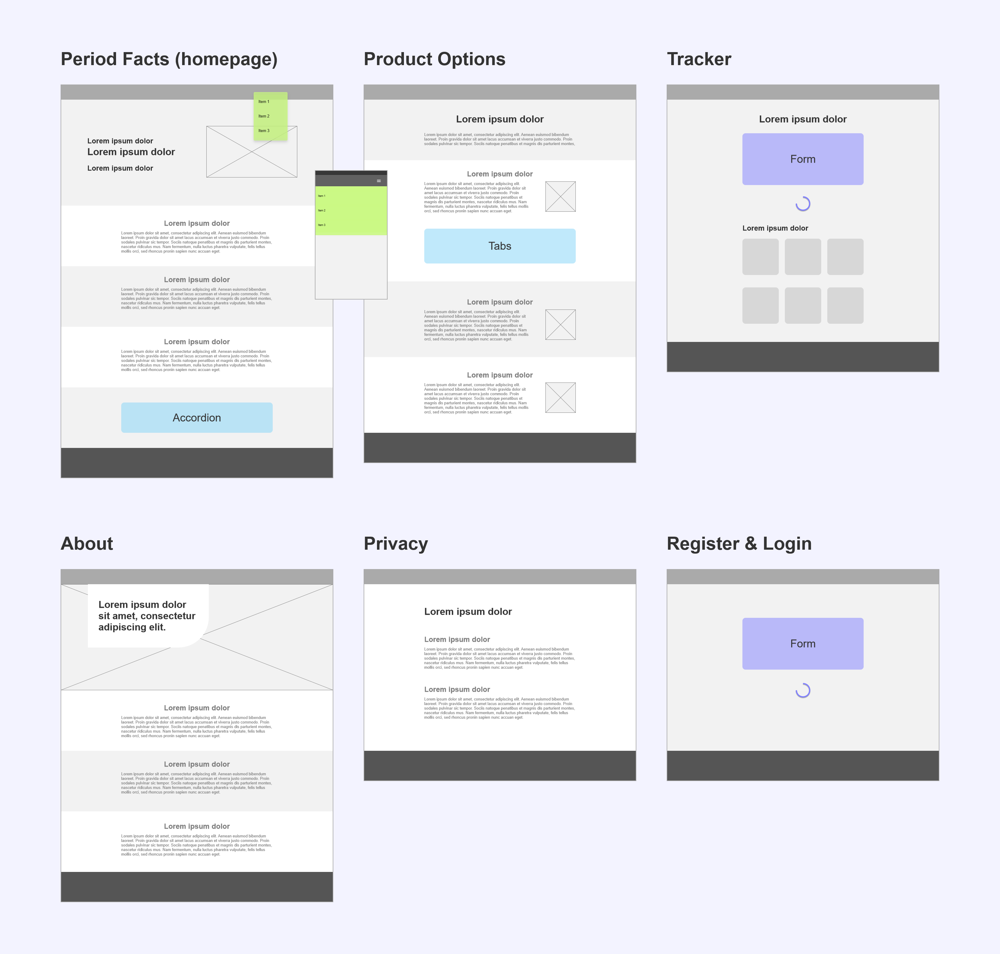
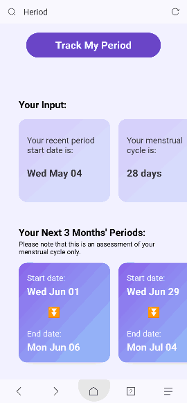
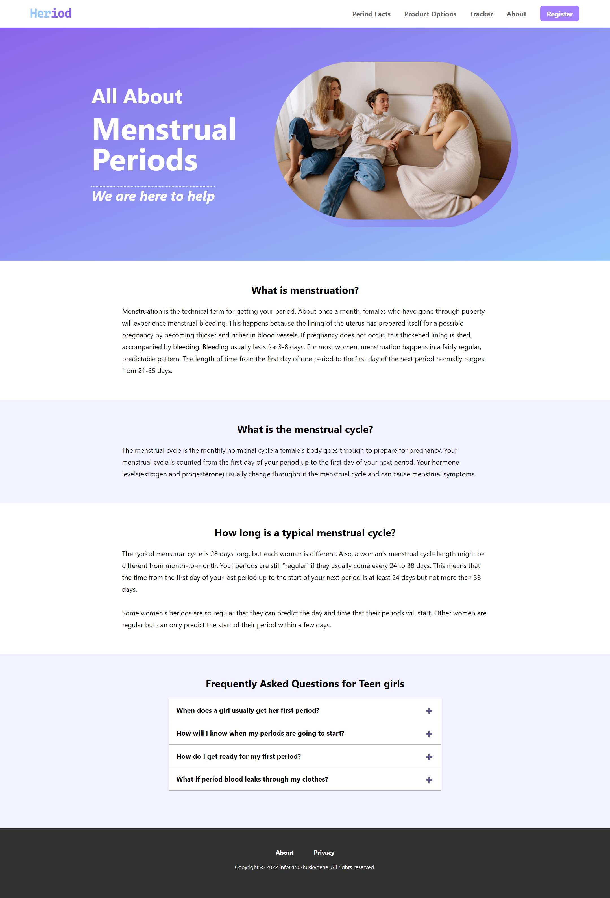
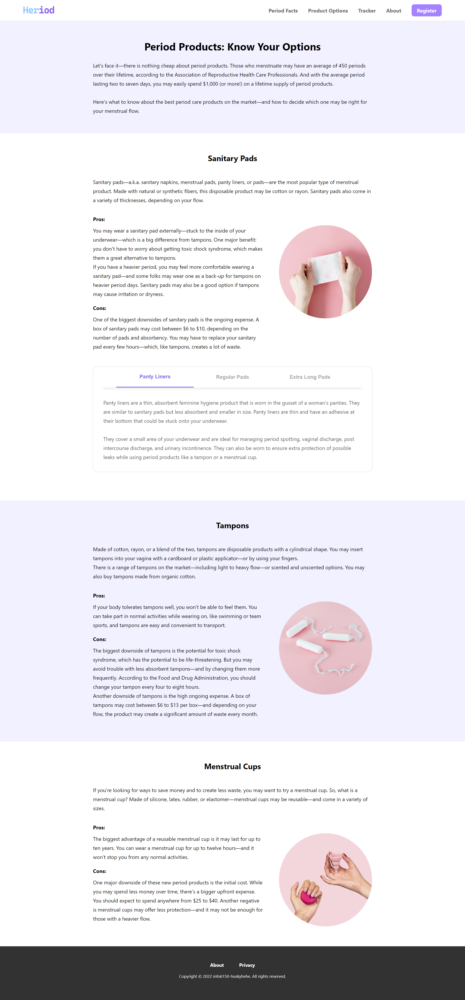
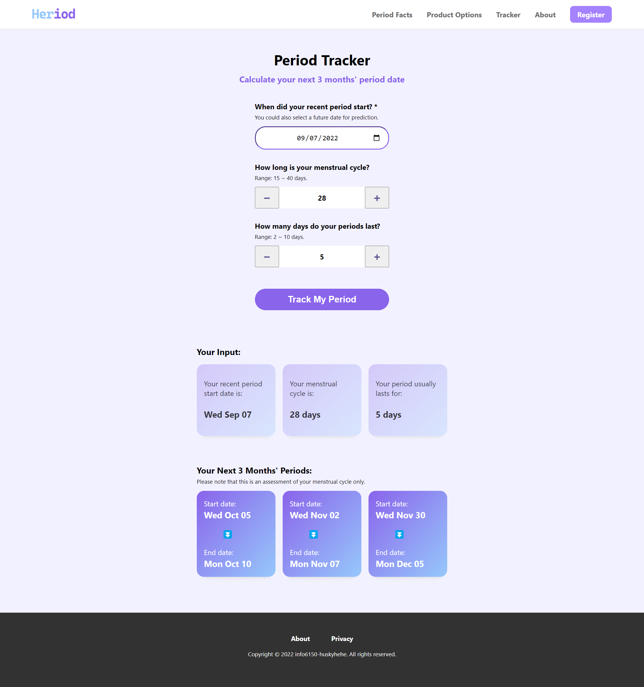
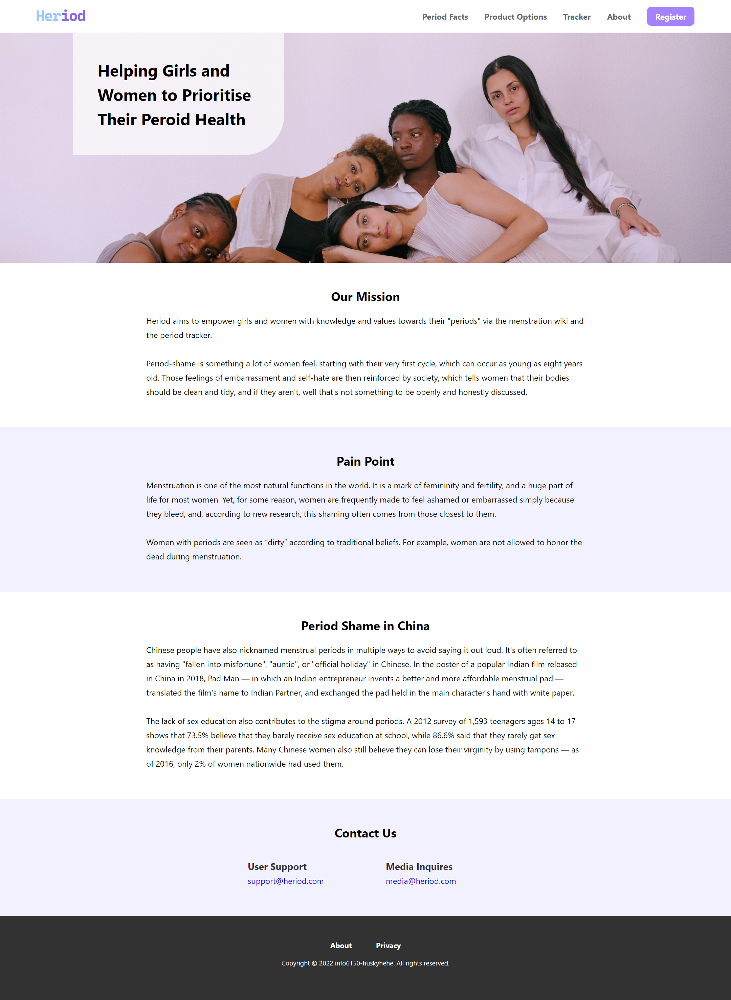

## Table of Contents
* [1 General Intro](#1-general-intro)
* [2 Technologies Used](#2-technologies-used)
* [3 File Structure](#3-file-structure)
* [4 WireFrames](#4-wireframes)
* [5 Key Features](#5-key-features)
* [6 Screenshots](#6-screenshots)
* [7 Setup](#7-setup)


<br/>

## 1 General Intro
The topic is about **menstruation period**, aiming to empower girls and women with knowledge and values towards their "periods" via the menstruation wiki and the period tracker.  
<br/>
The App includes **7** views, which can be divided into **3** categories:
- **Information display**: Period Facts, Product Options, About, Privacy
- **Calculation Tools**: Tracker
<br/>

## 2 Technologies Used
Project is created with:
- Javascript
- Node.js
- React
- HTML
- CSS

<b></b>

## 3 File Structure
```
The top level directory structure is as follows:
.
└── /src
    ├── /assets             - images
    ├── /components         - reusable components
    ├── /css                - css stylesheets
    ├── /data               - content data stored as const variables
    ├── /services           - fake-services provided by Prof.Brett
    ├── /views              - pages in the app
    ├── App.jsx
    └── index.js
```
<br/>

## 4 Wireframes


<br/>

## 5 Key Features
Features below are required for the final project.

### 5.1 Forms
- **Tracker**: 1 date input

### 5.2 Complex UIs
- **Period Facts** (homepage): 1 accordion
- **Product Options**: 1 group of tabs
- **Header**: dropdown menu -- PC
- **Header**: slide-in menu -- mobile

### 5.3 Transforms & Animations
- **Header**: dropdown menu's animation -- PC
- **Header**: hamburger menu' slide-in and icon transform -- mobile

### 5.4 Loading Indicators
- **Tracker**: when click the "Track my period" button


### 5.5 Special Layout for Mobiles
- **Tracker**: the generated report could be swiped back and forth on mobiles.



<br />

## 6 Screenshots





<br />

## 7 Setup
To run this project, install it locally using npm:
```
npm install
npm run build
npm start
```
Visit url http://localhost:3000/.

<br />

## 8 Licenses and References
### 8.1 Images Licenses
| Image Name | License | Original Source
|-----|-----|-----|
|`favicon.png`<br />`logo.png`| Self-designed | - |
|`hero.png`<br />`about-hero.jpg`|[Pexels License](https://www.pexels.com/license/) |  https://www.pexels.com/photo/women-sitting-on-brown-sofa-5793913/<br />https://www.pexels.com/photo/photo-of-women-sitting-on-orange-sofa-3810832/ |
|`option-pads.jpg`<br />`option-tampons.jpg`|[Pexels License](https://www.pexels.com/license/) | https://www.pexels.com/photo/person-holding-white-and-pink-floral-textile-7692336/<br />https://www.pexels.com/photo/a-three-tampon-on-pink-surface-7691980/ |
|`option-cups.jpg`|[Pixabay License](https://pixabay.com/service/license/) | https://pixabay.com/photos/cup-menstrual-menstruation-rule-3137097/ |

### 8.2 Icon Licenses
| Icon Name | License | Original Source
|-----|-----|-----|
| `gg-spinner`<br />`gg-menu`<br />`gg-close` | [The MIT License (MIT)](https://css.gg/doc/licence)<br />Copyright © 2019-2020 css.gg | https://css.gg/spinner<br />https://css.gg/menu<br />https://css.gg/close |
| `/2795`<br />`/2796`<br />`/23EC` | [Unicode License](https://www.unicode.org/license.txt)<br />Copyright © 1991-2022 Unicode, Inc. | https://www.unicode.org/charts/PDF/U2700.pdf<br />https://www.unicode.org/charts/PDF/U2300.pdf |


### 8.3 References
1. *Your period*. Menstrual Cycle Basics – Your Period. (n.d.). Retrieved April 29, 2022, from https://www.yourperiod.ca/normal-periods/menstrual-cycle-basics/#cycleGeneral 

2. *Your menstrual cycle*. Your menstrual cycle | Office on Women's Health. (n.d.). Retrieved April 29, 2022, from https://www.womenshealth.gov/menstrual-cycle/your-menstrual-cycle  

3. *Starting your periods*. NHS. (n.d.). NHS choices. Retrieved April 29, 2022, from https://www.nhs.uk/conditions/periods/starting-periods/

4. *6 Types of Period Products: Know Your Options*. FSA Store (n.d.). Retrieved April 29, 2022, from https://fsastore.com/learn-6-types-of-period-products-know-your-options.html

5. *Period 101: Types of sanitary pads to pick from*. Heyday Care LLP. Retrieved April 29, 2022, from https://heydaycare.com/blogs/period-care/period-101-types-of-sanitary-pads-to-pick-from   

6. *Nearly half of us women have experienced 'period shaming'*. MHDay. (n.d.). Retrieved May 4, 2022, from https://menstrualhygieneday.org/nearly-half-us-women-experienced-period-shaming/  

7. *The unspeakable pain of period poverty and shame in China*. RADII. (2020, September 23). Retrieved May 4, 2022, from https://radiichina.com/menstrual-period-poverty-shame-china/ 

<br/>

## 9 Room for Improvement
Things that could be improved in the future:
### Tracker
- [ ] Visualize the tracker report as calendars
- [ ] Add [Google Calendar Api](https://developers.google.com/calendar/api)
- [ ] Give user an option to store their generated report in their profiles
